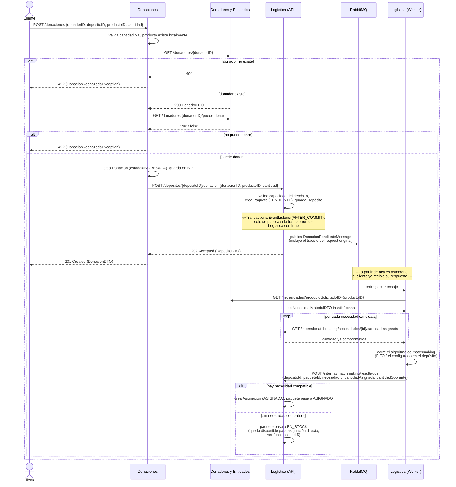

# Funcionalidad 1 — Realizar una donación

## Dónde arranca el flujo

| | |
|---|---|
| **Componente** | Donaciones |
| **Endpoint** | `POST /donaciones` |
| **Controller** | `DonacionesController.registrarDonacion(...)` |
| **Archivo** | `src/main/java/ar/edu/utn/dds/k3003/controllers/DonacionesController.java` (línea 36) |
| **Fachada** | `Fachada.registrarDonacion(DonacionDTO)` |
| **Archivo** | `src/main/java/ar/edu/utn/dds/k3003/Fachada.java` (línea 156) |

**Body esperado** (`DonacionDTO`): `donadorID`, `depositoID`, `productoID`, `cantidad`, `descripcion`. El `id` **no** se manda — lo genera el propio componente; si viaja, el controller rechaza con 400 antes de tocar la Fachada.

## Dónde termina

Este es el flujo más largo de los 6: tiene una parte **síncrona** (la respuesta HTTP al cliente) y una parte **asíncrona** que sigue corriendo después de que el cliente ya recibió el 201 (el matchmaking automático vía RabbitMQ). El request HTTP termina en Donaciones devolviendo el `DonacionDTO` creado; el flujo de negocio completo termina en Logística, en el worker, cuando registra el resultado del matchmaking (una `Asignacion` nueva, o el paquete pasa a `EN_STOCK` si no hubo necesidad compatible).

## Precondiciones

1. El producto (`productoID`) tiene que existir en el catálogo local de Donaciones.
2. El donador tiene que existir en Donadores y Entidades.
3. El donador tiene que estar habilitado para donar (`puedeDonar`) — un donador `SOSPECHOSO` (5+ quejas, ver [funcionalidad 3](../03-registrar-queja/README.md)) solo puede donar la mitad de las veces; uno `BANEADO` (10+ quejas), nunca.
4. El depósito indicado tiene que existir en Logística, tener un algoritmo de matchmaking configurado, y tener capacidad para la cantidad donada.

## Diagrama de secuencia

## Paso a paso, con archivo y línea

| # | Quién actúa | Qué hace | Archivo : línea |
|---|---|---|---|
| 1 | Cliente → Donaciones | `POST /donaciones` | `controllers/DonacionesController.java:36` |
| 2 | Donaciones | Valida `cantidad > 0` y que el `id` no venga seteado | `Fachada.java:157-165` |
| 3 | Donaciones | Valida que `productoID` exista en su propio repositorio | `Fachada.java:166-168` |
| 4 | Donaciones → Donadores | `GET /donadores/{id}` vía `FachadaDonadoresYEntidadesHttp` | `Fachada.java:216-224` (método `validarQueElDonadorPuedaDonar`) |
| 5 | Donaciones → Donadores | `GET /donadores/{id}/puede-donar` | `Fachada.java:230-238` |
| 6 | Donaciones | Crea la entidad `Donacion` con estado inicial **`INGRESADA`**, la persiste | `model/Donacion.java:63`, `Fachada.java:172-181` |
| 7 | Donaciones → Logística | `POST /depositos/{id}/donacion` vía `FachadaLogisticaHttp.gestionarDonacion(...)` | `Fachada.java:183-193` |
| 8 | Logística | Valida capacidad del depósito, crea `Paquete` en estado `PENDIENTE` | `Fachada.java:159-186` (Logística) |
| 9 | Logística | Publica un `ApplicationEvent` interno (`DonacionRegistradaEvent`) | `Fachada.java:192-204` (Logística) |
| 10 | Logística | `@TransactionalEventListener(AFTER_COMMIT)` lo recibe recién cuando el commit de la transacción se confirmó, y publica a RabbitMQ | `messaging/DonacionRegistradaListener.java`, `messaging/DonacionProducer.java` |
| 11 | Donaciones | Responde `201 Created` al cliente | `controllers/DonacionesController.java:40` |
| **— a partir de acá, asíncrono —** | | | |
| 12 | Worker (Logística) | Recibe el mensaje de la cola, arma el MDC con el `traceId` que viajó en el mensaje | `worker/AsignacionWorker.java:56-76` |
| 13 | Worker → Donadores | `GET /necesidades?productoSolicitadoID=...` | `worker/AsignacionWorker.java:78-81` |
| 14 | Worker → Logística (interna) | Por cada necesidad candidata: `GET /internal/matchmaking/necesidades/{id}/cantidad-asignada` | `worker/AsignacionWorker.java:87-92` |
| 15 | Worker | Corre el algoritmo de matchmaking configurado en el depósito | `worker/AsignacionWorker.java:94-100` |
| 16 | Worker → Logística (interna) | `POST /internal/matchmaking/resultados` | `worker/AsignacionWorker.java:106-114`, `controllers/MatchmakingInternalController.java` |
| 17 | Logística | Si hay match: crea `Asignacion` (`ASIGNADA`). Si no: el paquete pasa a `EN_STOCK` | `Fachada.java:391-441` (Logística, método `registrarResultadoMatchmakingDetallado`) |

## Qué se loguea en cada paso (Better Stack)

| Evento | Componente | Cuándo |
|---|---|---|
| `donacion.registrada` (Donaciones) | Donaciones | Al guardar la donación, con `donacion`, `donador`, `producto`, `cantidad`, `deposito` |
| `donacion.registrada` (Logística) | Logística | Al crear el paquete en el depósito, con `deposito`, `paquete`, `donacion`, `algoritmo` |
| `rabbit.publicado` | Logística | Al publicar el mensaje en la cola, con `traceId` incluido |
| `matchmaking.recibido` | Logística (worker) | Al recibir el mensaje |
| `matchmaking.finalizado` / `matchmaking.sin_asignacion` | Logística (worker/API) | Al terminar de procesar el resultado |
| `integracion.fallida` | Donaciones | Si falla cualquiera de las llamadas a Donadores o Logística |

Como todos estos logs comparten el mismo `traceId` (propagado por HTTP con `TracePropagationInterceptor` y por el mensaje de Rabbit con `DonacionPendienteMessage.traceId()`), se puede reconstruir el flujo completo — request HTTP + el procesamiento asíncrono que pasa varios segundos después — buscando ese `traceId` en Better Stack.

## Casos de rechazo (no son errores del cliente, son reglas de negocio)

- Donador no registrado en Donadores y Entidades → `422` (`DonacionRechazadaException`).
- Donador no habilitado (`puedeDonar = false`, por ser `SOSPECHOSO` con mala suerte en el sorteo, o `BANEADO`) → `422`.
- Producto inexistente en el catálogo de Donaciones → `404` (`NoSuchElementException`).
- Depósito sin algoritmo configurado, o sin capacidad → error desde Logística, que sube como `IntegracionException` (502) del lado de Donaciones.

## Nota sobre el ciclo de vida del estado de la donación

La donación **no** pasa a `ACEPTADA` en este flujo — se crea en `INGRESADA` y se queda así hasta que Logística confirma la entrega física del paquete. Eso ocurre recién en la [funcionalidad 2](../02-reportar-entrega/README.md).
