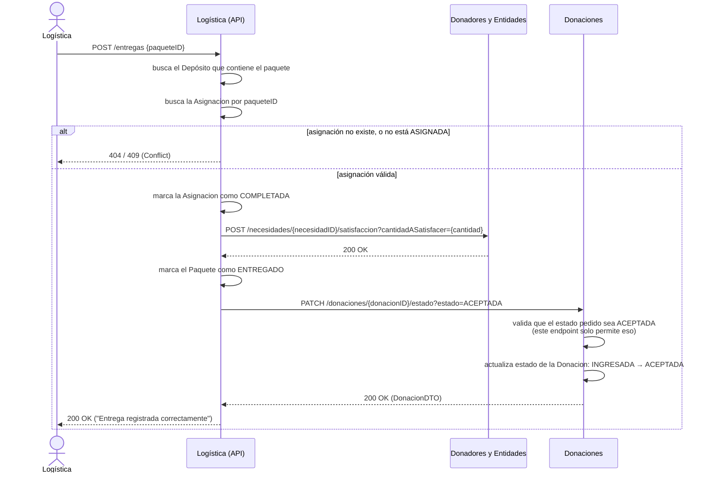

# Funcionalidad 2 — Reportar la entrega de un paquete

## Dónde arranca el flujo

| | |
|---|---|
| **Componente** | Logística |
| **Endpoint** | `POST /entregas` |
| **Controller** | `LogisticaController.reportarEntrega(PaqueteDTO)` |
| **Archivo** | `src/main/java/ar/edu/utn/dds/k3003/controllers/LogisticaController.java` (línea 136) |
| **Service → Fachada** | `LogisticaService.reportarEntrega(...)` → `Fachada.reportarEntrega(PaqueteDTO)` |
| **Archivo** | `src/main/java/ar/edu/utn/dds/k3003/Fachada.java` (línea 258) |

**Body esperado** (`PaqueteDTO`): solo necesita el `id` del paquete — es lo que carga el repartidor/logística cuando confirma que la entrega se hizo.

A diferencia de la funcionalidad 1, **este flujo lo dispara un humano de Logística** (o el sistema que use para escanear el paquete entregado), no otro componente.

## Dónde termina

Termina en **dos componentes distintos a la vez**: Donadores y Entidades (la necesidad queda parcial o totalmente satisfecha) y Donaciones (la donación pasa a estado `ACEPTADA`). Es la única de las 6 funcionalidades donde Logística es quien **llama hacia afuera** a los otros dos componentes en la misma operación.

## Precondiciones

1. Tiene que existir un `Paquete` con ese ID en algún depósito de Logística.
2. Tiene que existir una `Asignacion` para ese paquete, y tiene que estar en estado **`ASIGNADA`** (es decir, el paquete ya pasó por el matchmaking de la funcionalidad 1, o por la asignación directa de la funcionalidad 5 — no alcanza con que el paquete exista, tiene que estar *asignado* a alguna necesidad).

## Diagrama de secuencia

## Paso a paso, con archivo y línea

| # | Quién actúa | Qué hace | Archivo : línea |
|---|---|---|---|
| 1 | Logística (humano) → API | `POST /entregas` | `controllers/LogisticaController.java:136` |
| 2 | Logística | Ubica el depósito que contiene ese paquete | `Fachada.java:265-267` |
| 3 | Logística | Busca la `Asignacion` por `paqueteId`; valida que esté `ASIGNADA` | `Fachada.java:269-274` |
| 4 | Logística | Marca la `Asignacion` como `COMPLETADA` | `Fachada.java:278-279` |
| 5 | Logística → Donadores | `POST /necesidades/{id}/satisfaccion?cantidadASatisfacer=...` vía `FachadaDonadoresYEntidadesHttp.satisfacerNecesidad(...)` | `Fachada.java:281-284` |
| 6 | Logística | Marca el `Paquete` como `ENTREGADO` | `Fachada.java:286` |
| 7 | Logística → Donaciones | `PATCH /donaciones/{id}/estado?estado=ACEPTADA` vía `FachadaDonacionesHttp.cambiarEstadoDeDonacion(...)` | `Fachada.java:289-292` |
| 8 | Donaciones | Actualiza el estado de la donación (único valor que este endpoint acepta: `ACEPTADA`) | `controllers/DonacionesController.java:75-83`, `Fachada.java` (método `cambiarEstadoDeDonacion`) |
| 9 | Logística | Responde `200 OK` al llamador original | `controllers/LogisticaController.java:140` |

## Qué se loguea en cada paso (Better Stack)

| Evento | Componente | Detalle |
|---|---|---|
| `entrega.reportada` | Logística | Con `paquete`, `deposito`, `necesidad`, `cantidad`, `donacion` — se loguea una sola vez, al final, con todo el contexto ya resuelto |
| `donacion.estado_cambiado` | Donaciones | Con `donacion` y `estadoNuevo=ACEPTADA` |
| `integracion.fallida` | Donaciones | Si por algún motivo el `PATCH` llega mal formado (no debería pasar viniendo de Logística, pero queda cubierto igual) |

No hay logging explícito del lado de Donadores para la satisfacción de necesidad en este paso — la necesidad se actualiza silenciosamente. Es una asimetría menor entre componentes que se podría nivelar agregando un `log.info` en `NecesidadController`/`Fachada.satisfacerNecesidad` de Donadores si se quiere trazabilidad completa ahí también.

## Casos de rechazo

- Paquete inexistente → `404` (`ResourceNotFoundException`).
- Asignación inexistente para ese paquete → `404`.
- Asignación existe pero no está `ASIGNADA` (por ejemplo, ya se reportó la entrega antes y quedó `COMPLETADA`) → `409 Conflict` (`ConflictException`) — esto previene reportar la misma entrega dos veces.

## Relación con las otras funcionalidades

- Es el cierre natural de la [funcionalidad 1](../01-realizar-donacion/README.md) (la donación llega a buen puerto) y también puede cerrar una asignación que se generó por la vía directa de la [funcionalidad 5](../05-registrar-necesidad/README.md) (`asignarDesdeStock`) — el código no distingue el origen de la asignación en este punto, solo que esté `ASIGNADA`.
- La actualización del estado del donador en Donadores y Entidades (funcionalidad 6, estadísticas) **no** depende de este paso — las estadísticas del donador dependen de su categoría e insignias en Incentivos, que a su vez dependen de la [funcionalidad 4](../04-procesar-donador/README.md), no de si sus donaciones puntuales fueron entregadas.
