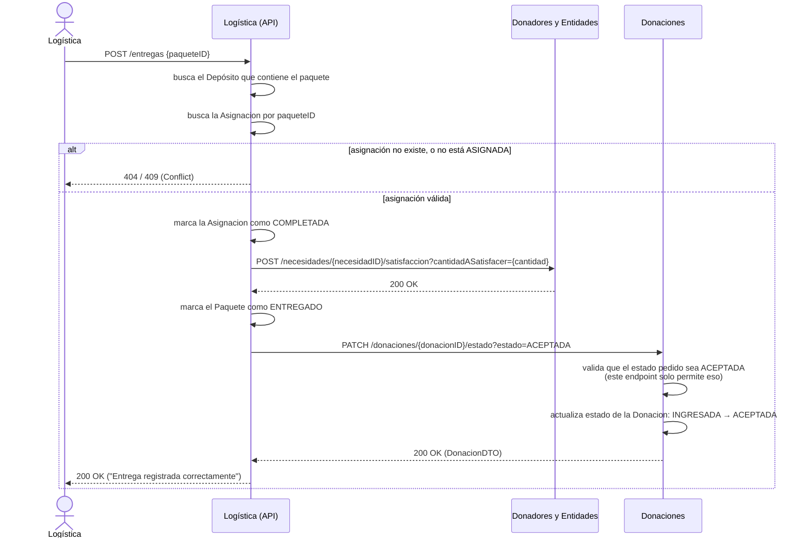

# Reportar Entrega

```mermaid
sequenceDiagram
    actor Logística
    participant LOG as Logística (API)
    participant DYE as Donadores y Entidades
    participant DON as Donaciones

    Logística->>LOG: POST /entregas {paqueteID}
    LOG->>LOG: busca el Depósito que contiene el paquete
    LOG->>LOG: busca la Asignacion por paqueteID
    alt asignación no existe, o no está ASIGNADA
        LOG-->>Logística: 404 / 409 (Conflict)
    else asignación válida
        LOG->>LOG: marca la Asignacion como COMPLETADA

        LOG->>DYE: POST /necesidades/{necesidadID}/satisfaccion?cantidadASatisfacer={cantidad}
        DYE-->>LOG: 200 OK

        LOG->>LOG: marca el Paquete como ENTREGADO

        LOG->>DON: PATCH /donaciones/{donacionID}/estado?estado=ACEPTADA
        DON->>DON: valida que el estado pedido sea ACEPTADA<br/>(este endpoint solo permite eso)
        DON->>DON: actualiza estado de la Donacion: INGRESADA → ACEPTADA
        DON-->>LOG: 200 OK (DonacionDTO)

        LOG-->>Logística: 200 OK ("Entrega registrada correctamente")
    end
```