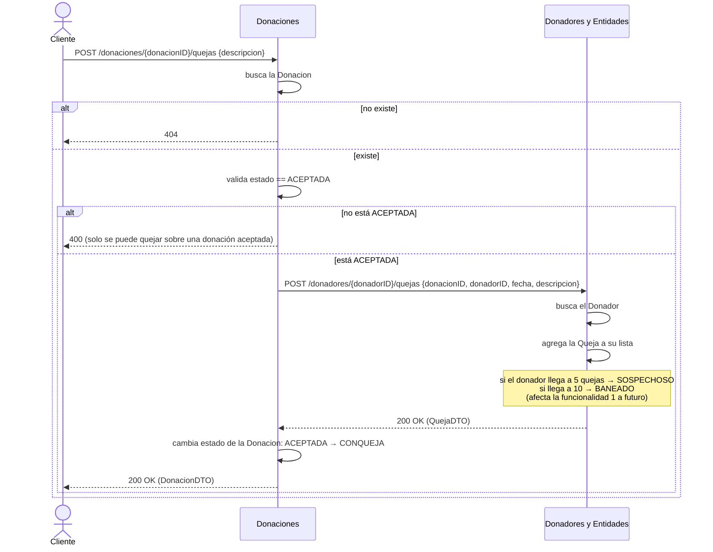
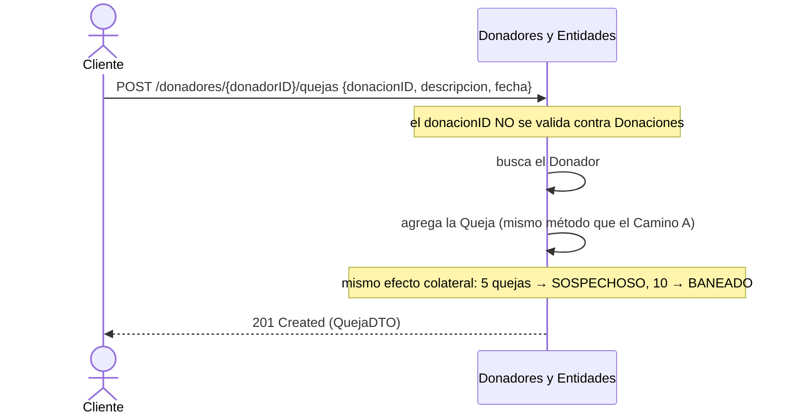

# Funcionalidad 3 — Registrar una queja sobre una donación ya entregada

## ⚠️ Importante: esta funcionalidad tiene DOS puntos de entrada distintos

A diferencia de las otras 5, encontré que el sistema permite registrar una queja de dos formas que **no pasan por el mismo camino**. Documento las dos porque ambas están implementadas y activas, pero solo una coincide exactamente con el nombre de la funcionalidad ("sobre una donación **ya entregada**").

---

## Camino A (recomendado) — arranca en Donaciones, valida que la donación esté entregada

| | |
|---|---|
| **Componente** | Donaciones |
| **Endpoint** | `POST /donaciones/{id}/quejas` |
| **Controller** | `DonacionesController.registrarQueja(...)` |
| **Archivo** | `controllers/DonacionesController.java` (línea 85) |
| **Fachada** | `Fachada.registrarQuejaEnDonacion(donacionID, descripcion)` |
| **Archivo** | `Fachada.java` (línea 316) |

Este es el único de los dos caminos que efectivamente valida la precondición que dice el nombre de la funcionalidad: **la donación tiene que estar en estado `ACEPTADA`** (ver [funcionalidad 2](../02-reportar-entrega/README.md)) para poder quejarse de ella. Si la donación todavía está `INGRESADA`, o ya tiene otra queja (`CONQUEJA`), rechaza con `400`.

### Diagrama de secuencia — Camino A

### Paso a paso — Camino A

| # | Quién actúa | Qué hace | Archivo : línea |
|---|---|---|---|
| 1 | Cliente → Donaciones | `POST /donaciones/{id}/quejas` | `controllers/DonacionesController.java:85-90` |
| 2 | Donaciones | Busca la donación; si no existe, `404` | `Fachada.java:321`, `Fachada.java:246-250` (`buscarDonacion`) |
| 3 | Donaciones | Valida `estado == ACEPTADA` | `Fachada.java:323-326` |
| 4 | Donaciones → Donadores | `POST /donadores/{donadorID}/quejas` vía `FachadaDonadoresYEntidadesHttp.agregarQueja(...)` | `Fachada.java:328-331` |
| 5 | Donadores | Busca el donador (si no existe, excepción) | `Fachada.java:182-183` |
| 6 | Donadores | Crea la `Queja`, la agrega a la lista del donador | `Fachada.java:185-192` |
| 7 | Donadores | **Efecto colateral importante**: si con esta queja el donador llega a 5, pasa a `SOSPECHOSO`; si llega a 10, pasa a `BANEADO` | `model/Donador.java:79-88` (método `registrarQueja`) |
| 8 | Donaciones | Cambia el estado local de la donación: `ACEPTADA` → `CONQUEJA` | `Fachada.java:333-334` |

---

## Camino B (alternativo) — directo en Donadores, sin validar el estado de la donación

| | |
|---|---|
| **Componente** | Donadores y Entidades |
| **Endpoint** | `POST /donadores/{id}/quejas` |
| **Controller** | `DonadorController.registrarQueja(...)` |
| **Archivo** | `controllers/DonadorController.java` (línea 52) |
| **Fachada** | `Fachada.agregarQueja(QuejaDTO)` — el mismo método que usa el Camino A internamente |

La diferencia clave: acá el `donacionID` que viaja en el body es **un dato suelto sin validar** — nadie confirma que esa donación exista, ni que esté entregada. Es, en la práctica, una puerta directa para registrar una queja aunque no haya pasado por Donaciones.

### Diagrama de secuencia — Camino B

---

## Qué se loguea en cada paso (Better Stack)

| Evento | Componente | Camino |
|---|---|---|
| `queja.registrada_en_donacion` | Donaciones | Solo Camino A — con `donacion` y `donador` |
| `queja.registrada` | Donadores | **Ambos caminos** (es el mismo método `Fachada.agregarQueja`) — con `queja`, `donador`, `donacion` |
| `donador.estado_cambiado` | Donadores | Si la queja hace que el donador cruce el umbral de 5 o 10 y alguien llama después a `modificarEstado` — **ojo:** el cambio a `SOSPECHOSO`/`BANEADO` automático dentro de `Donador.registrarQueja()` no pasa por `Fachada.modificarEstado`, así que ese log en particular **no se dispara automáticamente** en este flujo. Es un evento que hoy queda sin loguear a nivel aplicación (se ve reflejado recién si alguien consulta el donador después). |

## Casos de rechazo

- **Camino A**: donación inexistente (`404`), donación no está `ACEPTADA` (`400`).
- **Camino B**: donador inexistente (`DonadorNoEncontradoException`); no valida nada del lado de la donación.

## Nota / hallazgo para el equipo

El Camino B rompe un poco la garantía que promete el nombre de la funcionalidad — permite cargar una queja sin que haya una donación real y entregada detrás. No lo modifiqué (es una decisión de negocio, no un tema de logging), pero vale la pena que el grupo decida conscientemente si:
- Se deja así porque `POST /donadores/{id}/quejas` sirve para otro caso de uso más genérico (quejas no ligadas a una donación puntual), o
- Se agrega ahí también la validación contra Donaciones, para que las dos puertas de entrada se comporten igual.

Además, el evento `donador.estado_cambiado` que loguea Donadores solo se dispara vía `modificarEstado` (llamado por otro componente o admin), **no** cuando el cambio a `SOSPECHOSO`/`BANEADO` ocurre como efecto colateral de acumular quejas. Si quieren ver ese evento reflejado en Better Stack, conviene agregar un log dentro de `Donador.registrarQueja()` mismo o justo después de esa llamada en `Fachada.agregarQueja()`.
