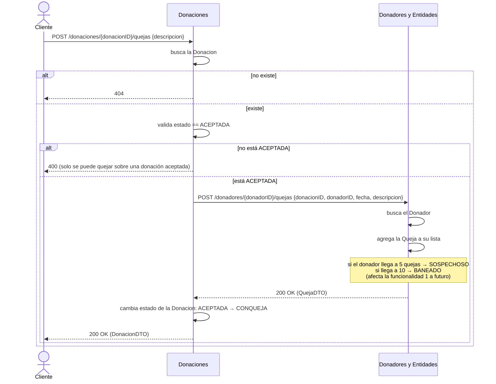

# Registrar Queja

```mermaid
sequenceDiagram
    actor Cliente
    participant DON as Donaciones
    participant DYE as Donadores y Entidades

    Cliente->>DON: POST /donaciones/{donacionID}/quejas {descripcion}
    DON->>DON: busca la Donacion
    alt no existe
        DON-->>Cliente: 404
    else existe
        DON->>DON: valida estado == ACEPTADA
        alt no está ACEPTADA
            DON-->>Cliente: 400 (solo se puede quejar sobre una donación aceptada)
        else está ACEPTADA
            DON->>DYE: POST /donadores/{donadorID}/quejas {donacionID, donadorID, fecha, descripcion}
            DYE->>DYE: busca el Donador
            DYE->>DYE: agrega la Queja a su lista
            Note over DYE: si el donador llega a 5 quejas → SOSPECHOSO<br/>si llega a 10 → BANEADO<br/>(afecta la funcionalidad 1 a futuro)
            DYE-->>DON: 200 OK (QuejaDTO)
            DON->>DON: cambia estado de la Donacion: ACEPTADA → CONQUEJA
            DON-->>Cliente: 200 OK (DonacionDTO)
        end
    end
```