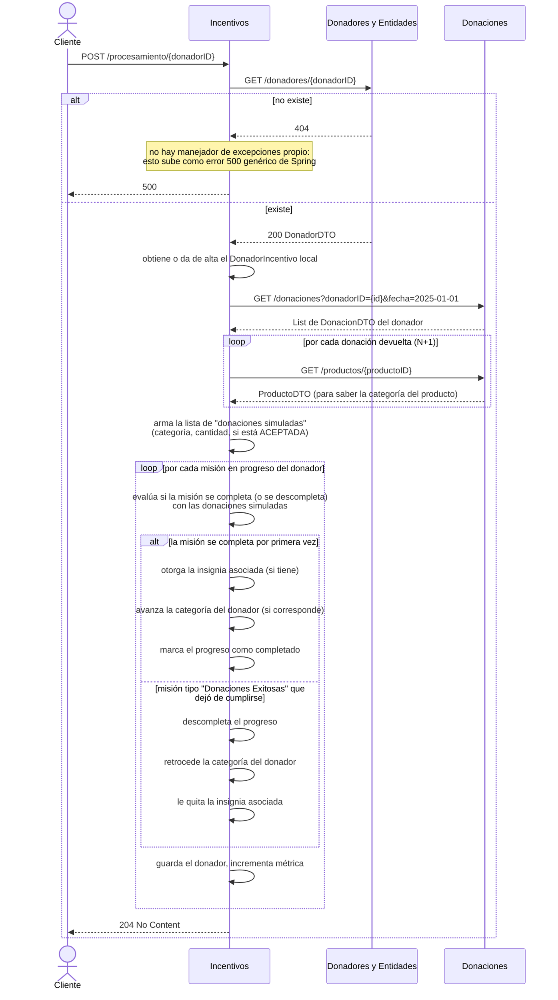

# Funcionalidad 4 — Procesar un donador (incentivos)

## Dónde arranca el flujo

| | |
|---|---|
| **Componente** | Incentivos |
| **Endpoint** | `POST /procesamiento/{donadorID}` |
| **Controller** | `ProcesamientoController.procesarDonador(...)` |
| **Archivo** | `controllers/ProcesamientoController.java` (línea 20) |
| **Fachada** | `Fachada.procesarDonador(donadorID)` |
| **Archivo** | `Fachada.java` (línea 289) |

No recibe body — todo el trabajo se hace a partir del `donadorID` de la URL. Es un endpoint que se llama a demanda (por ejemplo, después de que un donador hace una donación, o de forma periódica) para recalcular el progreso de sus misiones.

## Dónde termina

Termina íntegramente dentro de Incentivos — actualiza (o no) las misiones, insignias y categoría del donador en la base de datos propia de Incentivos. No hay ningún llamado de vuelta hacia otros componentes al final; toda la escritura es local.

## Precondiciones

1. El donador tiene que existir en Donadores y Entidades (se valida con una llamada HTTP, no localmente).
2. Nada más — si es la primera vez que se procesa a este donador, Incentivos se da de alta a sí mismo un registro local (`DonadorIncentivo`) automáticamente.

## Diagrama de secuencia

## Paso a paso, con archivo y línea

| # | Quién actúa | Qué hace | Archivo : línea |
|---|---|---|---|
| 1 | Cliente → Incentivos | `POST /procesamiento/{donadorID}` | `controllers/ProcesamientoController.java:20` |
| 2 | Incentivos → Donadores | `GET /donadores/{id}` vía `validarQueDonadorExiste(...)` | `Fachada.java:95-101` |
| 3 | Incentivos | Busca (o crea) el `DonadorIncentivo` local — este es un registro **propio** de Incentivos, distinto del `Donador` que vive en Donadores y Entidades | `Fachada.java:103-112` |
| 4 | Incentivos → Donaciones | `GET /donaciones?donadorID=...&fecha=2025-01-01` vía `FachadaDonacionesHttp.buscarPorDonadorYFechaInicio(...)` | `Fachada.java:296-300` |
| 5 | Incentivos → Donaciones | **Por cada donación devuelta**: `GET /productos/{id}` para conocer su categoría | `Fachada.java:302-316` |
| 6 | Incentivos | Arma `List<DonacionSimulada>` (categoría del producto, cantidad, si la donación está `ACEPTADA`) | `Fachada.java:310-316` |
| 7 | Incentivos | Por cada `ProgresoMision` del donador, evalúa `mision.estaCompleta(donaciones)` | `Fachada.java:318-333` |
| 8a | Incentivos | Si se completa por primera vez: otorga insignia, avanza categoría, marca progreso completado | `Fachada.java:333-364` |
| 8b | Incentivos | Si es una misión de tipo `DONACIONES_EXITOSAS` que dejó de cumplirse: descompleta el progreso, retrocede categoría, quita la insignia | `Fachada.java:366-390` |
| 9 | Incentivos | Guarda el donador, incrementa la métrica `donatrack.incentivos.donadores.procesados` | `Fachada.java:~405-410` |

## ⚠️ Hallazgo: llamada N+1 hacia Donaciones

El paso 5 hace **una llamada HTTP por cada donación** que tenga el donador para averiguar la categoría del producto (`GET /productos/{id}`), en vez de traer esa información en un solo request. Con un donador que acumuló 50 donaciones, este endpoint dispara 51 llamadas HTTP salientes (1 + 50) antes de poder evaluar una sola misión. No es un bug que afecte el resultado — el flujo funciona correctamente — pero es el punto más lento de las 6 funcionalidades y el primero que conviene optimizar si el procesamiento se nota lento en la demo (por ejemplo, agregando un endpoint tipo `GET /productos?ids=...` en Donaciones que devuelva varios de una vez).

## ⚠️ Hallazgo: manejo de errores más débil que en el resto

Incentivos es el único de los 4 componentes que **no tiene un `@RestControllerAdvice`** (ver el `README.md` de logging de la entrega anterior). Si en el paso 2 el donador no existe, la excepción del cliente HTTP (`HttpClientErrorException.NotFound` o similar) no se atrapa en ningún lado y sube tal cual — el cliente de este endpoint recibe un `500` genérico de Spring en vez de un `404` o `422` con mensaje claro, a diferencia de cómo Donaciones maneja el mismo caso en la funcionalidad 1 (que sí responde `422` con `DonacionRechazadaException`). Una vez que el `logback-spring.xml` esté aplicado, ese 500 sí va a quedar logueado igual (Spring lo loguea por default a través del logger de `DispatcherServlet`), pero sin la claridad estructurada que tienen los otros casos.

## Qué se loguea en cada paso (Better Stack)

| Evento | Cuándo |
|---|---|
| `donador.procesamiento_iniciado` | Al arrancar el método, ya validado que el donador existe |
| `insignia.otorgada` | Cada vez que se le otorga una insignia nueva |
| `categoria.actualizada` | Cada vez que avanza (o retrocede) de categoría |
| `mision.completada` | Cada vez que una misión pasa a completada por primera vez |
| `mision.progreso_perdido` | Cada vez que una misión de "Donaciones Exitosas" deja de cumplirse |
| `donador.procesado` | Al final de cada misión procesada en el loop (nota: se loguea una vez por misión, no una sola vez por donador — así está también la métrica que ya existía, se mantuvo la misma granularidad) |
| `integracion.fallida` | No aplica en Incentivos — este componente no tiene el log centralizado de integración que sí tiene Donaciones; cada llamada fallida se comporta distinto según el punto |

## Relación con las otras funcionalidades

Esta es la funcionalidad que le da sentido a la [funcionalidad 6](../06-estadisticas-donador/README.md): las estadísticas que se muestran ahí (categoría, insignias, misión en curso) son exactamente lo que este proceso calcula y persiste acá. Sin correr `procesarDonador` después de nuevas donaciones, las estadísticas quedan desactualizadas.
