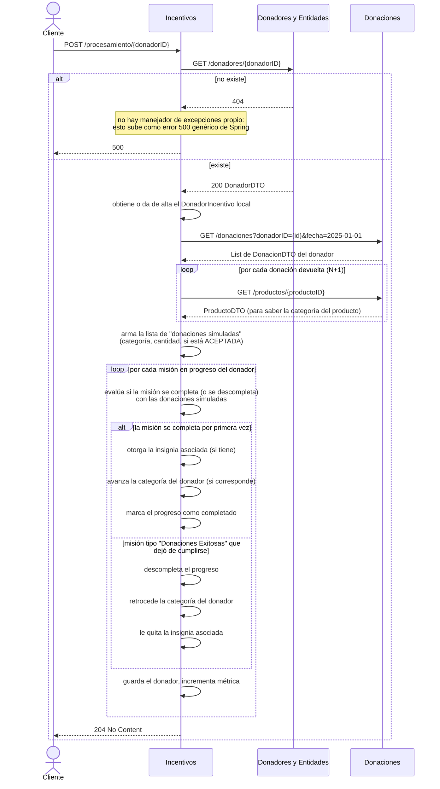

# Procesar Donador

```mermaid
sequenceDiagram
    actor Cliente
    participant INC as Incentivos
    participant DYE as Donadores y Entidades
    participant DON as Donaciones

    Cliente->>INC: POST /procesamiento/{donadorID}
    INC->>DYE: GET /donadores/{donadorID}
    alt no existe
        DYE-->>INC: 404
        Note over INC: no hay manejador de excepciones propio:<br/>esto sube como error 500 genérico de Spring
        INC-->>Cliente: 500
    else existe
        DYE-->>INC: 200 DonadorDTO
        INC->>INC: obtiene o da de alta el DonadorIncentivo local

        INC->>DON: GET /donaciones?donadorID={id}&fecha=2025-01-01
        DON-->>INC: List de DonacionDTO del donador

        loop por cada donación devuelta (N+1)
            INC->>DON: GET /productos/{productoID}
            DON-->>INC: ProductoDTO (para saber la categoría del producto)
        end

        INC->>INC: arma la lista de "donaciones simuladas"<br/>(categoría, cantidad, si está ACEPTADA)

        loop por cada misión en progreso del donador
            INC->>INC: evalúa si la misión se completa (o se descompleta)<br/>con las donaciones simuladas
            alt la misión se completa por primera vez
                INC->>INC: otorga la insignia asociada (si tiene)
                INC->>INC: avanza la categoría del donador (si corresponde)
                INC->>INC: marca el progreso como completado
            else misión tipo "Donaciones Exitosas" que dejó de cumplirse
                INC->>INC: descompleta el progreso
                INC->>INC: retrocede la categoría del donador
                INC->>INC: le quita la insignia asociada
            end
            INC->>INC: guarda el donador, incrementa métrica
        end
        INC-->>Cliente: 204 No Content
    end
```