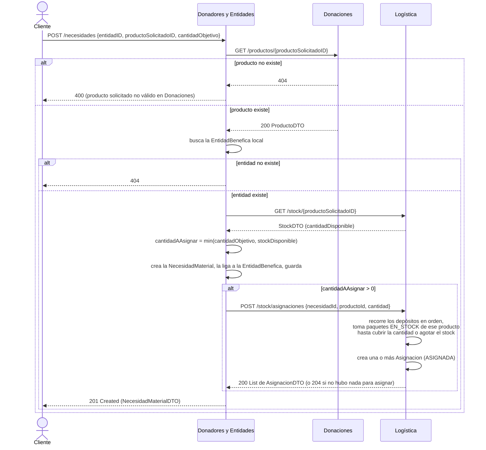

# Funcionalidad 5 — Registrar una nueva necesidad

## Dónde arranca el flujo

| | |
|---|---|
| **Componente** | Donadores y Entidades |
| **Endpoint** | `POST /necesidades` |
| **Controller** | `NecesidadController.registrar(...)` |
| **Archivo** | `controllers/NecesidadController.java` (línea 26) |
| **Fachada** | `Fachada.registrarNecesidad(NecesidadMaterialDTO)` |
| **Archivo** | `Fachada.java` (línea 131) |

**Body esperado** (`NecesidadMaterialDTO`): `entidadID`, `productoSolicitadoID`, `cantidadObjetivo`.

## Dónde termina

Es la funcionalidad con **más componentes involucrados de las 6**: toca Donadores (dueño de la necesidad), Donaciones (solo para validar que el producto exista) y Logística (para saber si hay stock disponible y, si lo hay, asignarlo ahí mismo). Termina en Logística, si había stock, con una o más `Asignacion` creadas directamente — sin pasar por RabbitMQ ni por el worker, a diferencia de la funcionalidad 1.

## Precondiciones

1. El producto solicitado (`productoSolicitadoID`) tiene que existir en el catálogo de Donaciones.
2. La entidad benéfica (`entidadID`) tiene que existir localmente en Donadores.

## Diagrama de secuencia

## Paso a paso, con archivo y línea

| # | Quién actúa | Qué hace | Archivo : línea |
|---|---|---|---|
| 1 | Cliente → Donadores | `POST /necesidades` | `controllers/NecesidadController.java:26-29` |
| 2 | Donadores → Donaciones | `GET /productos/{id}` vía `FachadaDonacionesHttp.buscarProductoPorID(...)`, solo para validar que exista | `Fachada.java:133-139` |
| 3 | Donadores | Busca la `EntidadBenefica` local; si no existe, `404` | `Fachada.java:141-142` |
| 4 | Donadores → Logística | `GET /stock/{productoSolicitadoID}` vía `FachadaLogisticaHttp.consultarStock(...)` (client `LogisticaRestClient`) | `Fachada.java:145-146` |
| 5 | Donadores | Calcula `cantidadAAsignar = min(cantidadObjetivo, stockDisponible)` | `Fachada.java:147-150` |
| 6 | Donadores | Crea la `NecesidadMaterial`, la asocia a la entidad, la persiste | `Fachada.java:153-158` |
| 7 | Donadores → Logística | Si `cantidadAAsignar > 0`: `POST /stock/asignaciones` vía `LogisticaRestClient.asignarDesdeStock(...)` | `Fachada.java:160-166` |
| 8 | Logística | Recorre los depósitos (ordenados por ID) tomando paquetes ya `EN_STOCK` de ese producto hasta cubrir la cantidad solicitada o agotar el stock; crea una `Asignacion` por cada paquete usado | `Fachada.java:474-...` (Logística, método `asignarDesdeStock`) |
| 9 | Donadores | Responde `201 Created` con la necesidad creada (incluye cuánto quedó ya asignado, `cantidadAsignada`) | `controllers/NecesidadController.java:29` |

## Qué se loguea en cada paso (Better Stack)

| Evento | Componente | Detalle |
|---|---|---|
| `necesidad.registrada` | Donadores | Con `necesidad`, `entidad`, `producto`, `cantidadObjetivo`, `cantidadAsignada` — un solo log que ya incluye si hubo asignación directa o no |
| `integracion.fallida` | Donaciones | Si la validación del producto falla por un error de red (no por 404, que se maneja como regla de negocio) |

Del lado de Logística, la asignación directa por stock **no tiene un evento de dominio propio** (a diferencia de `matchmaking.asignado`, que es el que se usa para el flujo asíncrono de la funcionalidad 1). Es la misma clase `Asignacion` pero con `OrigenAsignacion.SOLICITUD_ENTIDAD` en vez de `OrigenAsignacion.MATCHMAKING` — así que hoy, si se busca `matchmaking.asignado` en Better Stack, esta asignación **no** va a aparecer ahí. Vale la pena, si el equipo quiere trazabilidad completa, agregar un `log.info("asignacion.solicitud_entidad necesidad=... producto=... cantidad=...")` en el método `asignarDesdeStock` de Logística.

## Casos de rechazo

- Producto inexistente en Donaciones → `400` (`IllegalArgumentException` con mensaje "producto solicitado no válido en Donaciones").
- Entidad benéfica inexistente → `404` (`NoSuchElementException`).
- Si Logística no está configurada (`fachadaLogistica == null`) o no hay stock, la necesidad se crea igual, simplemente con `cantidadAsignada = 0` — **no es un error**, es el caso normal cuando no hay stock disponible en el momento.

## Relación con las otras funcionalidades

- Si en el momento de registrar la necesidad no había stock (`cantidadAsignada = 0`), esa necesidad queda "insatisfecha" y es candidata a que el matchmaking automático de la [funcionalidad 1](../01-realizar-donacion/README.md) la resuelva más adelante, cuando llegue una donación nueva de ese producto.
- Cuando Logística reporta la entrega de un paquete asignado acá ([funcionalidad 2](../02-reportar-entrega/README.md)), es el mismo mecanismo de `satisfacerNecesidad` el que termina de cerrar el círculo, sin importar si la asignación vino del matchmaking automático o de esta asignación directa.
