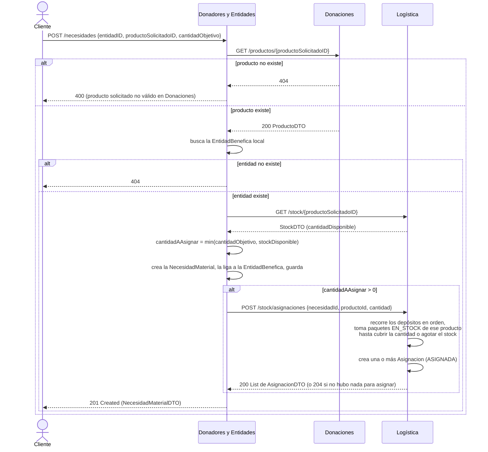

# Registrar Necesidad

```mermaid
sequenceDiagram
    actor Cliente
    participant DYE as Donadores y Entidades
    participant DON as Donaciones
    participant LOG as Logística

    Cliente->>DYE: POST /necesidades {entidadID, productoSolicitadoID, cantidadObjetivo}

    DYE->>DON: GET /productos/{productoSolicitadoID}
    alt producto no existe
        DON-->>DYE: 404
        DYE-->>Cliente: 400 (producto solicitado no válido en Donaciones)
    else producto existe
        DON-->>DYE: 200 ProductoDTO
        DYE->>DYE: busca la EntidadBenefica local
        alt entidad no existe
            DYE-->>Cliente: 404
        else entidad existe
            DYE->>LOG: GET /stock/{productoSolicitadoID}
            LOG-->>DYE: StockDTO (cantidadDisponible)
            DYE->>DYE: cantidadAAsignar = min(cantidadObjetivo, stockDisponible)
            DYE->>DYE: crea la NecesidadMaterial, la liga a la EntidadBenefica, guarda

            alt cantidadAAsignar > 0
                DYE->>LOG: POST /stock/asignaciones {necesidadId, productoId, cantidad}
                LOG->>LOG: recorre los depósitos en orden,<br/>toma paquetes EN_STOCK de ese producto<br/>hasta cubrir la cantidad o agotar el stock
                LOG->>LOG: crea una o más Asignacion (ASIGNADA)
                LOG-->>DYE: 200 List de AsignacionDTO (o 204 si no hubo nada para asignar)
            end

            DYE-->>Cliente: 201 Created (NecesidadMaterialDTO)
        end
    end
```