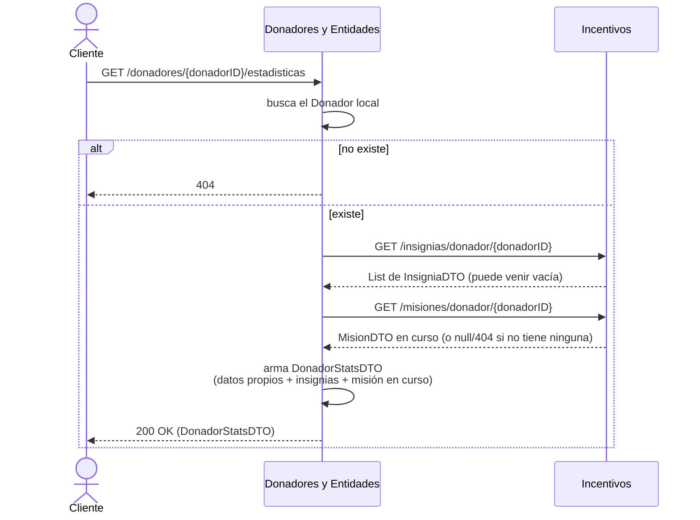

# Funcionalidad 6 — Obtener las estadísticas de un donador

## Dónde arranca el flujo

| | |
|---|---|
| **Componente** | Donadores y Entidades |
| **Endpoint** | `GET /donadores/{id}/estadisticas` |
| **Controller** | `DonadorController.obtenerStats(...)` |
| **Archivo** | `controllers/DonadorController.java` (línea 89) |
| **Fachada** | `Fachada.estadisticasDonador(donadorID)` |
| **Archivo** | `Fachada.java` (línea 322) |

Es la única de las 6 funcionalidades que es puramente de **lectura** — no escribe nada en ningún componente, solo agrega información de dos fuentes distintas.

## Dónde termina

Termina en el mismo request: Donadores agrega su propia información local con dos llamadas a Incentivos, arma el DTO combinado y responde. No hay pasos asíncronos ni efectos secundarios en otros componentes.

## Precondiciones

1. El donador tiene que existir en la base local de Donadores (no se valida en ningún otro componente — es dueño de ese dato).
2. Nada más — si Incentivos no tiene nada cargado para ese donador todavía (nunca se corrió la [funcionalidad 4](../04-procesar-donador/README.md)), la respuesta igual se arma, simplemente con listas/valores vacíos.

## Diagrama de secuencia

## Paso a paso, con archivo y línea

| # | Quién actúa | Qué hace | Archivo : línea |
|---|---|---|---|
| 1 | Cliente → Donadores | `GET /donadores/{id}/estadisticas` | `controllers/DonadorController.java:89-91` |
| 2 | Donadores | Busca el `Donador` local; si no existe, `404` (`NoSuchElementException`) | `Fachada.java:323` |
| 3 | Donadores → Incentivos | `GET /insignias/donador/{id}` vía `IncentivosRestClient.getInsigniasDeDonador(...)` | `Fachada.java:325-327` |
| 4 | Donadores → Incentivos | `GET /misiones/donador/{id}` vía `IncentivosRestClient.getMisionEnCursoDeDonador(...)` | `Fachada.java:329-335` |
| 5 | Donadores | Arma el `DonadorStatsDTO` final: id, nombre, apellido, edad, estado, categoría (propios) + lista de IDs de insignias + ID de la misión en curso | `Fachada.java:341-342` |

## Manejo de errores en las llamadas a Incentivos

Vale la pena mirar el cliente HTTP (`IncentivosRestClient.java`, en Donadores) porque **no deja que un fallo de Incentivos tire abajo la consulta de estadísticas**:

- Si `GET /insignias/donador/{id}` falla por cualquier motivo (Incentivos caído, timeout, etc.), el cliente atrapa la excepción, loguea un `warn` y devuelve una lista vacía en vez de propagar el error.
- Si `GET /misiones/donador/{id}` responde `404` (el donador no tiene ninguna misión en curso), se interpreta como "no tiene misión" y devuelve `null`, **sin** loguear nada — es un caso esperado, no un error. Si falla por cualquier otro motivo, ahí sí loguea `warn` y devuelve `null`.

Esto significa que las estadísticas de un donador **siempre responden**, aunque Incentivos esté completamente caído — simplemente van a venir con `insignias: []` y `misionEnCurso: null`, sin insignias ni misión, en vez de que el endpoint entero falle. Es una decisión de diseño razonable (degradación elegante) que vale la pena mantener.

## Qué se loguea en cada paso (Better Stack)

| Evento | Componente | Detalle |
|---|---|---|
| `donador.estadisticas_consultadas` | Donadores | Con `donador`, `categoria`, `cantidadInsignias` — se loguea siempre, incluso si Incentivos no respondió nada |
| *(warning sin evento de dominio)* | Donadores | Los `catch` del `IncentivosRestClient` logean con `log.warn("Error al conectar con Incentivos...")`, pero no siguen la convención `<contexto>.<evento>` del resto del sistema — son mensajes de texto libre. Se pueden buscar en Better Stack por texto, pero no aparecen si se filtra por el patrón `evento=` que usan el resto de los logs |

## Relación con las otras funcionalidades

Esta funcionalidad es, en esencia, una vista combinada de:
- **Donadores** (funcionalidad 3 y 5 la afectan indirectamente: más quejas → categoría/estado peor; nada de necesidad la toca directamente)
- **Incentivos** ([funcionalidad 4](../04-procesar-donador/README.md), que es la que realmente calcula y persiste la categoría, las insignias y el progreso de misiones que acá solo se leen)

Si las estadísticas se ven "desactualizadas" respecto a las donaciones recientes de alguien, el primer lugar para mirar no es este endpoint — es si se corrió `POST /procesamiento/{donadorID}` después de esas donaciones.
