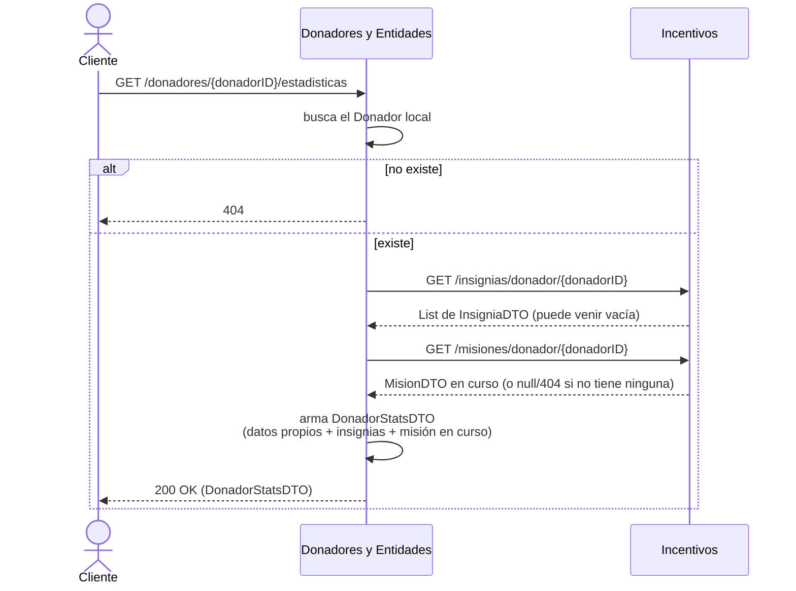

# Estadisticas Donador

```mermaid
sequenceDiagram
    actor Cliente
    participant DYE as Donadores y Entidades
    participant INC as Incentivos

    Cliente->>DYE: GET /donadores/{donadorID}/estadisticas
    DYE->>DYE: busca el Donador local
    alt no existe
        DYE-->>Cliente: 404
    else existe
        DYE->>INC: GET /insignias/donador/{donadorID}
        INC-->>DYE: List de InsigniaDTO (puede venir vacía)

        DYE->>INC: GET /misiones/donador/{donadorID}
        INC-->>DYE: MisionDTO en curso (o null/404 si no tiene ninguna)

        DYE->>DYE: arma DonadorStatsDTO<br/>(datos propios + insignias + misión en curso)
        DYE-->>Cliente: 200 OK (DonadorStatsDTO)
    end
```