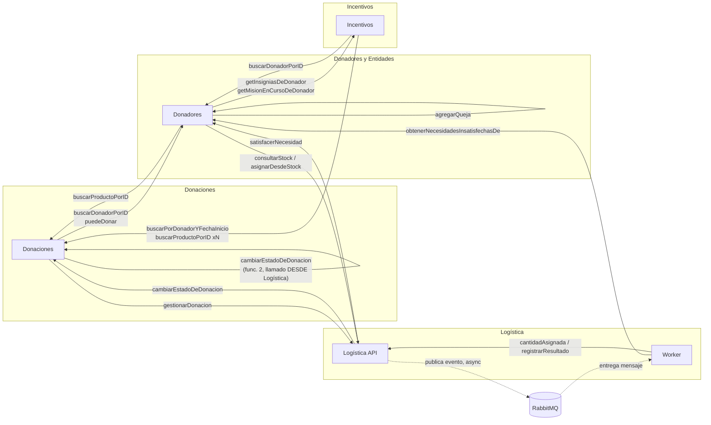

# DonaTrack — Análisis de flujo de las 6 funcionalidades principales (Entrega 5)

Este análisis está basado en el código real de los 4 repositorios (no en la
documentación de diseño), leyendo Controllers, Fachadas, clientes HTTP y el
worker de Logística línea por línea. Cada funcionalidad tiene su propia
carpeta con un `README.md` que documenta: dónde arranca el flujo, qué
componente(s) llama y con qué método, dónde termina, las precondiciones, un
diagrama de secuencia en Mermaid, y qué queda logueado en Better Stack en
cada paso (a partir del trabajo de logging centralizado ya aplicado).

```
entrega5-funcionalidades/
├── README.md                        (este archivo)
├── 01-realizar-donacion/README.md
├── 02-reportar-entrega/README.md
├── 03-registrar-queja/README.md
├── 04-procesar-donador/README.md
├── 05-registrar-necesidad/README.md
└── 06-estadisticas-donador/README.md
```

---

## Resumen: qué componentes toca cada funcionalidad

| # | Funcionalidad | Arranca en | Componentes que participan | Tipo |
|---|---|---|---|---|
| 1 | Realizar una donación | Donaciones | Donaciones → Donadores, Donaciones → Logística → *(async, RabbitMQ)* → Worker → Donadores + Logística | Síncrono + Asíncrono |
| 2 | Reportar entrega de un paquete | Logística | Logística → Donadores, Logística → Donaciones | Síncrono |
| 3 | Registrar una queja | Donaciones **o** Donadores (dos entry points, ver su README) | Donaciones → Donadores (camino A) / solo Donadores (camino B) | Síncrono |
| 4 | Procesar un donador | Incentivos | Incentivos → Donadores, Incentivos → Donaciones (N veces) | Síncrono |
| 5 | Registrar una nueva necesidad | Donadores | Donadores → Donaciones, Donadores → Logística | Síncrono |
| 6 | Obtener estadísticas de un donador | Donadores | Donadores → Incentivos (x2) | Síncrono, solo lectura |

La única funcionalidad genuinamente **asíncrona** es la 1: el cliente recibe
su respuesta antes de que termine el matchmaking automático, que sigue
corriendo en el worker de Logística después de que el HTTP ya se cerró.

## Vista general: quién le habla a quién

Este diagrama no es de una funcionalidad puntual — es un mapa de **todas las
integraciones sincrónicas entre componentes** que aparecen a lo largo de las
6 funcionalidades, para tener una foto completa del acoplamiento real del
sistema (más allá de lo que dice el diagrama de arquitectura de diseño).



**Lectura rápida de acoplamiento:** Donaciones y Logística se llaman mutuamente
(Donaciones dispara el flujo, Logística cierra el círculo en la entrega).
Donadores es el componente con más integraciones entrantes y salientes — le
pegan Donaciones, Logística e Incentivos, y él mismo le pega a Donaciones,
Logística e Incentivos. Incentivos es el más "hoja" de los 4: nadie lo llama
salvo para leer insignias/misiones (funcionalidad 6), y él solo llama hacia
afuera para validar y calcular (funcionalidad 4).

## Hallazgos transversales (no ligados a una sola funcionalidad)

Estos aparecen documentados en detalle dentro de cada README correspondiente,
pero los junto acá porque conviene que el grupo los vea juntos:

1. **Incentivos es el único componente sin manejador de excepciones propio**
   (ver funcionalidad 4). Cualquier error de integración con Donadores o
   Donaciones sube como `500` genérico en vez de un código HTTP claro.
2. **La funcionalidad 3 tiene dos puntos de entrada** con comportamiento
   distinto (uno valida que la donación esté entregada, el otro no). Vale la
   pena que el equipo decida si es intencional.
3. **N+1 en el procesamiento de un donador** (funcionalidad 4): una llamada
   HTTP a Donaciones por cada donación del historial, en vez de una sola
   llamada batch.
4. **La asignación directa por stock** (funcionalidad 5) no tiene un evento
   de dominio propio en los logs — queda "escondida" respecto al camino de
   matchmaking (funcionalidad 1), aunque ambas terminan creando una
   `Asignacion`.
5. **El cambio automático a `SOSPECHOSO`/`BANEADO`** por acumular quejas
   (funcionalidad 3) no queda logueado como evento propio — es un efecto
   colateral silencioso dentro del modelo `Donador`.

Ninguno de estos 5 puntos es un bug que rompa el sistema — son oportunidades
de mejora que aparecieron al trazar el código real, no cambios ya aplicados.

## Cómo se usó el trabajo de logging para armar esto

Cada README de funcionalidad tiene una tabla "Qué se loguea en cada paso" que
mapea 1 a 1 con los eventos que ya se agregaron en la entrega de logging
centralizado (`donatrack-entrega5-logging.zip`). Sirve como referencia
cruzada: si en la demo buscan un `traceId` en Better Stack y quieren saber
"¿en qué paso del flujo estoy parado?", el nombre del evento (`donacion.registrada`,
`matchmaking.finalizado`, `entrega.reportada`, etc.) los lleva directo a la
fila correspondiente en el README de esa funcionalidad.
